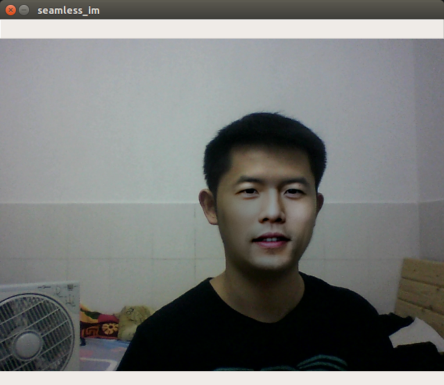

# simple_faceswap
使用opencv-python和dlib实现的简单换脸程序

## 准备 ##
* pip安装opencv-python、dlib
* 下载dlib人脸形状检测器模型数据：[shape_predictor_68_face_landmarks.dat.bz2](http://dlib.net/files/shape_predictor_68_face_landmarks.dat.bz2)，并解压在models文件夹下

## 实现步骤 ##
1. 使用dlib的shape_predictor_68_face_landmarks.dat模型获取人脸图片im1和摄像头图片im2的68个人脸特征点。
2. 根据上一步获得的特征点得到两张图片的人脸掩模im1_mask和im2_mask。
3. 利用68个特征点中的3个特征点，对人脸图片im1进行仿射变换使其脸部对准摄像头图片中的脸部，得到图片affine_im1。
4. 对人脸图片的掩模im1_mask也进行相同的仿射变换得到affine_im1_mask。
5. 对掩模im2_mask和掩模affine_im1_mask的掩盖部分取并集得到union_mask。
6. 利用opencv里的seamlessClone函数对仿射变换后的affine_im1和摄像头图片im2进行泊松融合，掩模为union_mask，得到融合后的图像seamless_im。

## 换脸效果 ##
* 周杰伦的帅气照：

* 利用杰伦的脸作为替换的脸的换脸效果：

